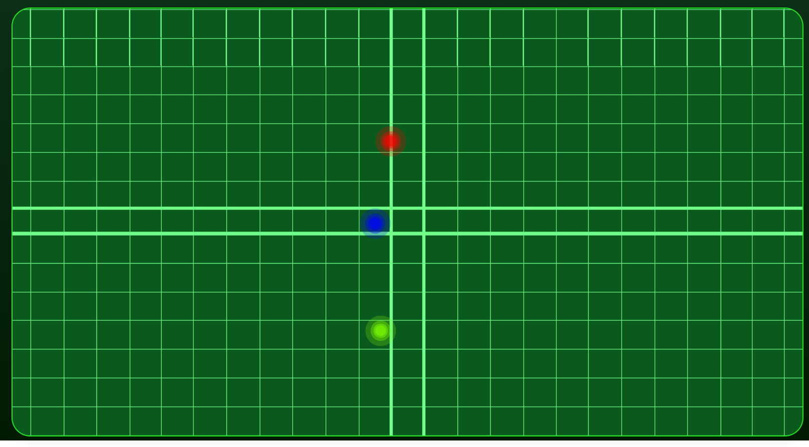

# Soundgraph
  

  ## Description:
  ___
  An interactive sound generator that allows the user to play 3 octave ranges with touches/clicks on the screen - eventually record and play your own sounds as well!

  ## Table of Contents:
  ___
  1) [Description](#description)
  2) [Installation](#installation)
  3) [Usage](#usage)
  4) [Img](#img)
  5) [Collaboration](#collaboration)
  6) [Tests](#tests)
  7) [Questions?](#questions?)
  8) [GitHub](#gitHub)
  9) [License](#license)

  ## Installation
  ___
  Simply visit the website at: https://windowmac-soundgraph.netlify.app/

  ## Usage
  ___
  Play a single note, harmonies, octaves, or any melody you can think of on the Soundgraph. As you slide your finger/s along the graph the pitch and volume of the sound will change with your movement.

  ## Img
  ___
  

  ## Collaboration:
  ___
  For now, just follow the [Contributor Covenant](https://www.contributor-covenant.org/)

  ## Tests
  ___
  none yet

  ## Questions?
  ___
  Please contact me at:
  My [GitHub](https://github.com/Windowmac)
  
  Or Email:
  <mckendree.strommer@gmail.com>

  
  ## License: 
  ___
  Licensed under [MIT License](https://opensource.org/licenses/MIT)